#### netty 核心组件

##### bootstrap and serverBootStrap
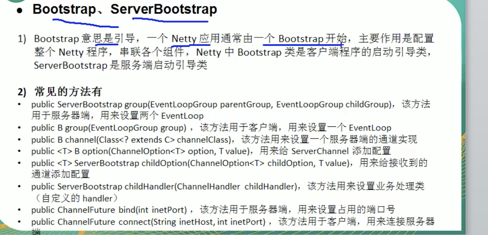

##### Future and ChannelFuture
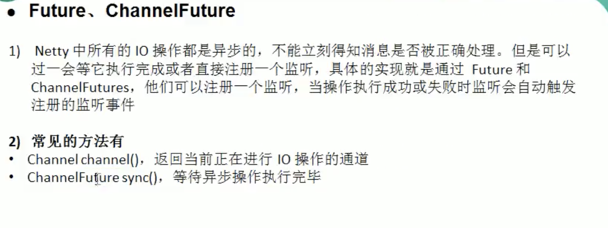

##### channel
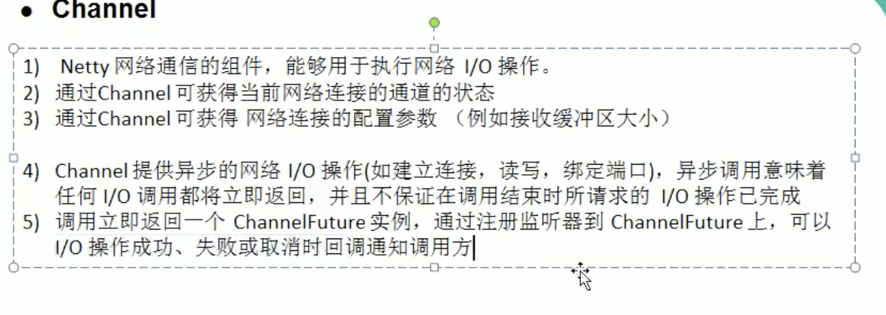
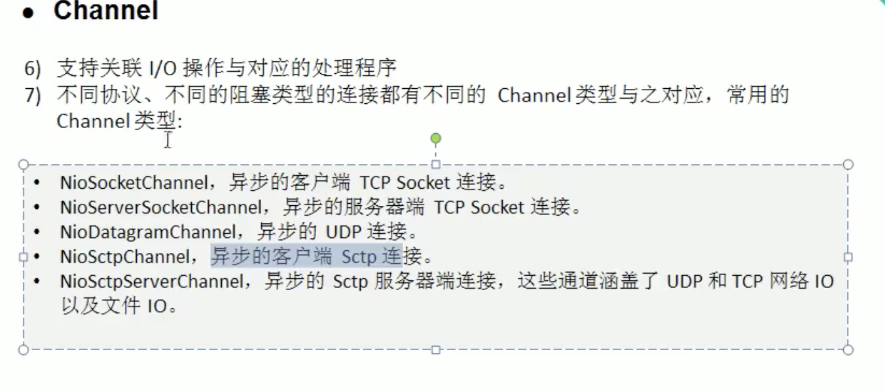

##### selector
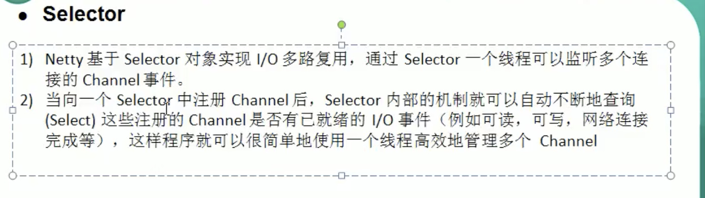

##### channelHandler
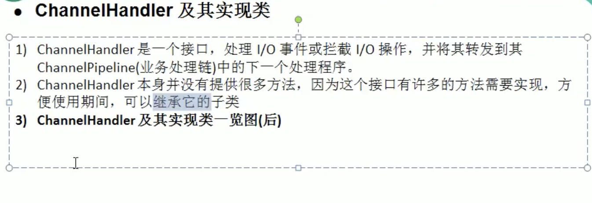
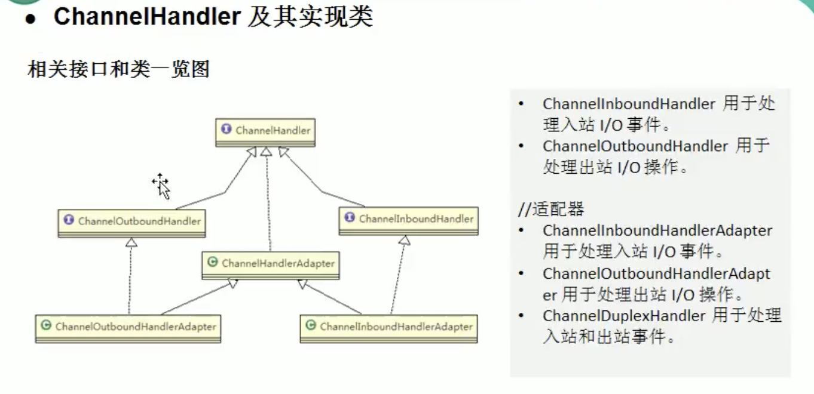
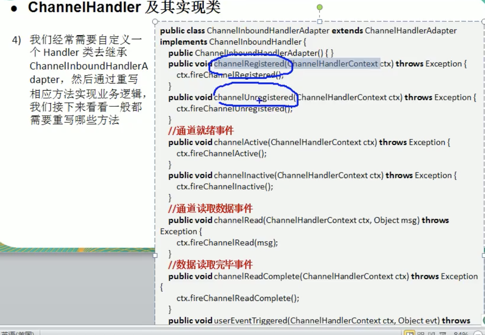

##### channelPipeline
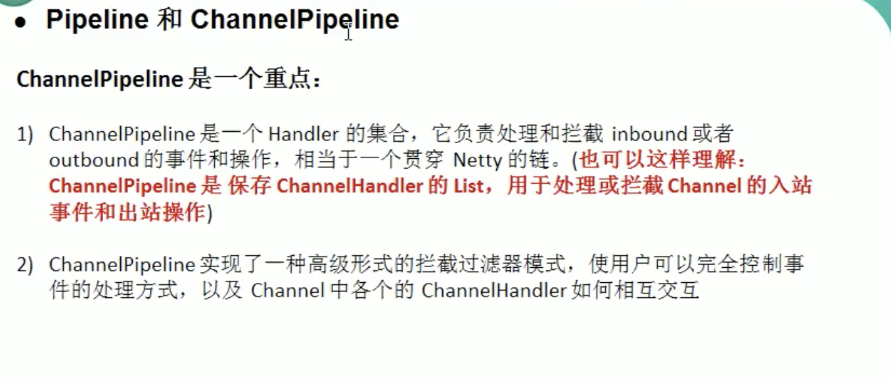
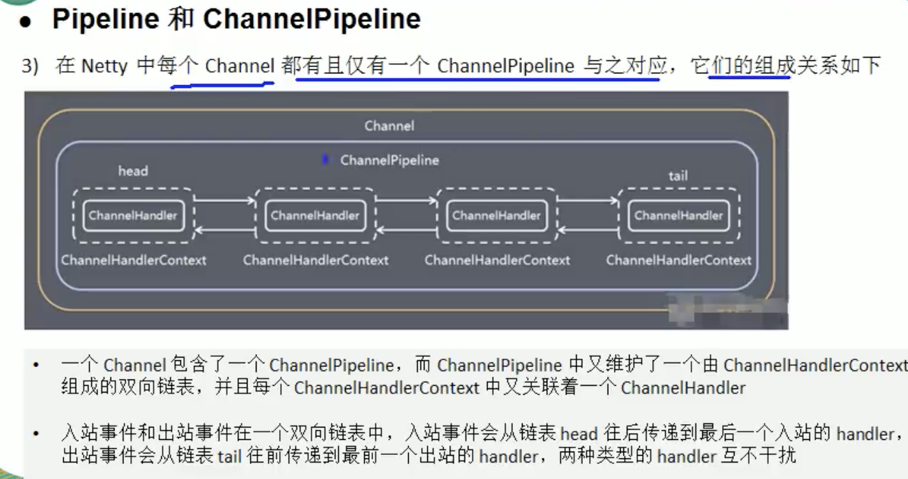
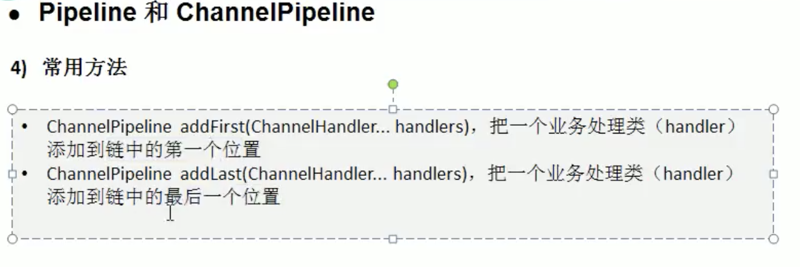

##### channelHandlerContext
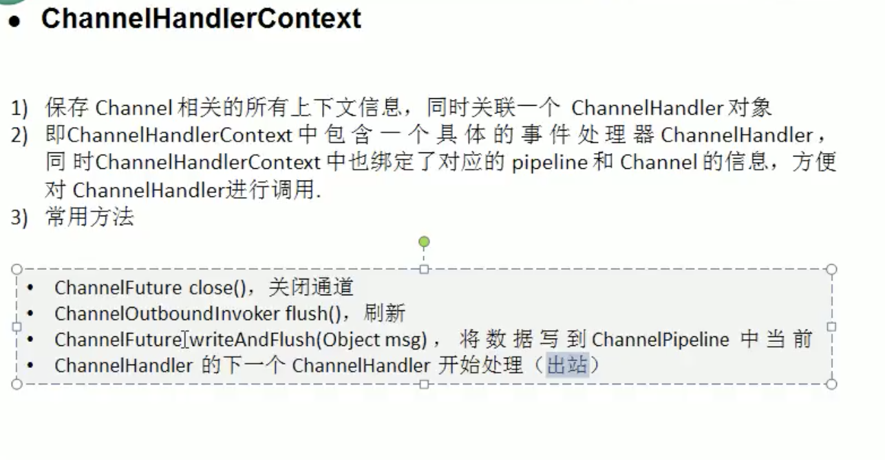

##### channelOption
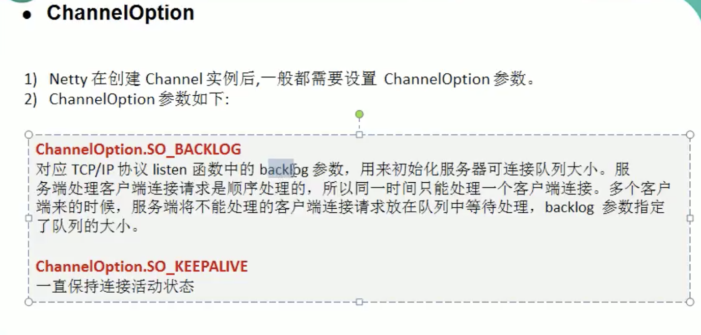

##### EventLoopGroup and NioEventLoopGroup
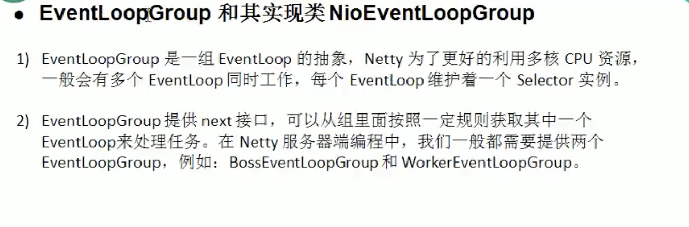
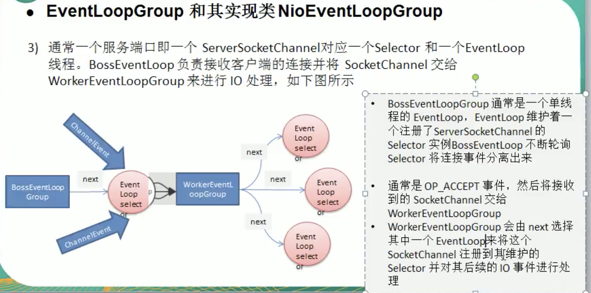
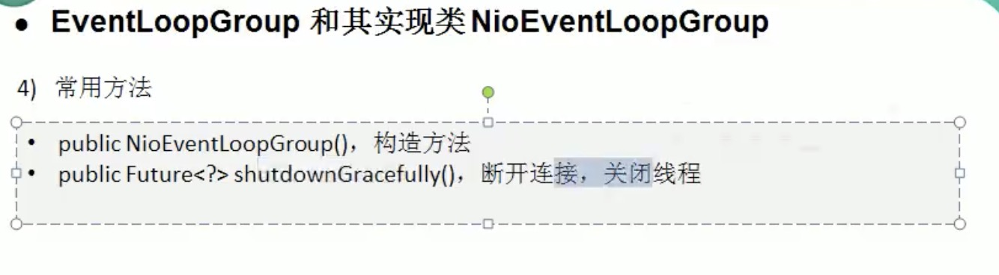

##### Unpooled
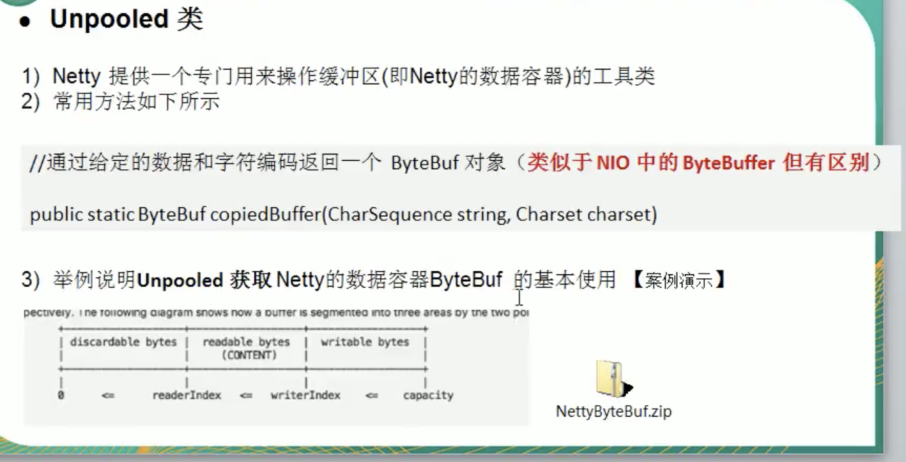
、、、

        ByteBuf buffer = Unpooled.buffer(10);

        for (int i = 0; i < 10; i++) {
            buffer.writeByte(i);
        }

        System.out.println("capacity=" + buffer.capacity()); // 10

        // 输出

        for (int i = 0; i < buffer.capacity(); i++) {
            System.out.println(buffer.readByte());
        }
        
、、、

